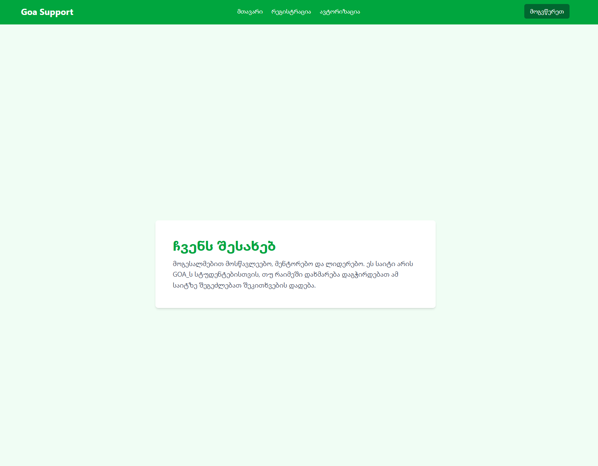
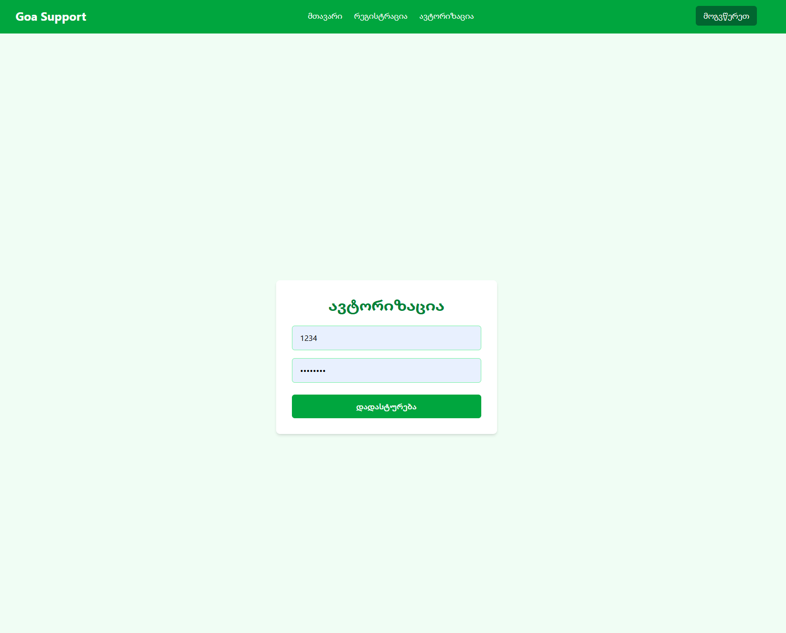
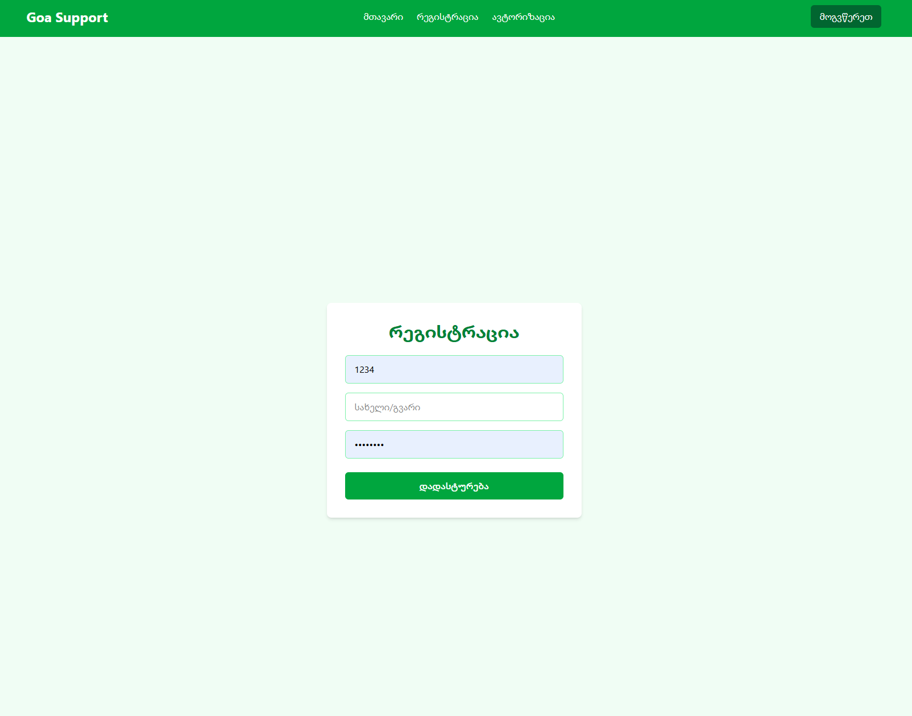

# 🧠 Goa Support

**Goa Support** is a web platform built for GOA Academy students to ask questions and get answers from moderators, admins, or fellow students. It encourages active collaboration, knowledge sharing, and quick support during the learning process.

---

## 📸 Screenshots

> *(Project is in development mode, so this screenshots is small part of the website)*





---

## 🚀 Live Demo

👉 [View Live Site](https://your-live-demo-link.vercel.app)

---

## ⚙️ Features

- 📝 Students can post questions
- 💬 Answers by moderators, admins, or students
- 🔐 Authentication system
- 🧍‍♂️ User roles: Student, Moderator, Admin
- 🕵️‍♂️ Protected routes
- 🧪 Responsive UI

---

## 🛠️ Tech Stack

- **Frontend:** React.js, Tailwind CSS, React Toastify, React Router.
- **Backend:** Node.js, Express.js
- **Database:** MongoDB
- **Auth:** JWT + HttpOnly Cookies
- **Hosting:** Vercel (frontend), Render/other (backend)

---

## 🧰 Getting Started

Clone the project:

```bash
git clone https://github.com/yourusername/goa-support.git
cd goa-support
